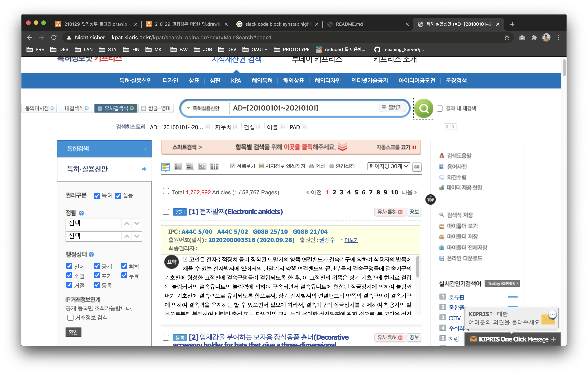

****# SA-PATENT-CRAWLER

### Introduction

#### Kipris

- `POST  http://kpat.kipris.or.kr/kpat/searchLogina.do?next=MainSearch#page1`
- 응답없음 => Chromium으로 추출


- `GET http://kpat.kipris.or.kr/kpat/biblioa.do?method=biblioMain_biblio&next=biblioViewSub01&applno=2020200003518&getType=BASE&link=N`
- 응답있음 => html 파싱으로 추출


#### DeepSearch

- 출원인번호가 `1`로 시작하는 경우 딥서치에서 해당 출원인(기업)을 Chromium으로 추출
### Installation & Execution

```sh
# common
mkdir outputs

# using npm
npm install && npm start:ch 

# using yarn
yarn && yarn start:ch
```

### Response

#### Patent Data

- 어미가 `*s`인 변수는 복수 개의 데이터를 의미합니다.
- 복수 개의 데이터를 담은 필드는 문자열 처리한 json 포맷입니다.
- python에서 사용하시려면 json을 파싱하신 후에 사용해주세요.

- 파일명 컨벤션: `patent_<start_date>_<end_date>.csv`
- inventionTitle: 발명명
- applicationNumber: 출원번호
- applicationDate: 출원일자
- registerStatus: 등록상태
- registerNumber: 등록번호
- registerDate: 등록일자
- publishNumber: 공개번호
- publishDate: 공개일자
- intlApplNumber: 국제출원번호
- intlApplDate: 국제출원일자
- intlPublishNumber: 국제공개번호
- intlPublishDate: 국제공개일자
- claimReqDate: 청구일자
- claimCount: 청구항수
- applicantNumber: 출원인번호
- citatingPatents: 인용특허 (json 타입)
  - nationality: 국적
  - publishNumber: 공보번호
  - publishDate: 공보일자
  - inventionTitle: 발명명
  - ipcCode: IPC코드
- cpcs: CPC (json 타입)
  - code: CPC 코드
  - date: CPC 일자
- ipcs: IPC (json 타입)
  - code: IPC 코드
  - date: IPC 일자
- citatedPatents: 피인용특허 (json 타입)
  - applicationDate: 출원일자
  - inventionTitle: 발명명
  - ipcCode: IPC코드
- familyPatents: 패밀리특허 (json 타입)
  - number: 패밀리번호
  - nationalityCode: 국가코드
  - nationality: 패밀러특허국적
  - type: 패밀리타입

#### Corporation Data

- 어미가 `*s`인 변수는 복수 개의 데이터를 의미합니다.
- 복수 개의 데이터를 담은 필드는 문자열 처리한 json 포맷입니다.
- python에서 사용하시려면 json을 파싱하신 후에 사용해주세요.

- 파일명 컨벤션: `corp_<start_date>_<end_date>.csv`
- applicantNumber: 출원인번호
- corpNumber: 법인번호
- businessNumber: 사업자등록번호
- repName: 대표자명
- estDate: 설립일자
- corpName: 법인명
- corpScale: 법인규모
- corpForm: 법인형태
- indCat: 산업분류
- nationality: 법인국적
- isExtAudit: 외감여부
- isClose: 폐업여부
- isPublic: 상장여부
- revenue: 매출액
- salesCost: 매출원가
- SellingAndAdmnstExp: 판매비와관리비
- nonOprtIncome: 영업외수익
- revenue: 매출액 
- salesCost: 매출원가 
- SellingAndAdmnstExp: 판매비와관리비 
- nonOprtIncome: 영업외수익 
- profit: 수익
- grossProfitLoss: 매출총이익(손실)
- operatingProfitLoss: 영업이익(손실)
- poofitBeforeIncomeTaxLoss: 법인세비용차감전계속사업이익(손실)
- incomeTaxExp: 계속영업손익법인세비용(부의법인세비용)
- continuingOperatingProfitLoss: 계속영업이익(손실)
- discontinuedOperatingProfitLoss: 중단영업이익(손실)
- TotalNetIncome: 총당기순이익
- OtherComprehensiveIncome: 기타포괄손익
- ComprehensiveIncome: 포괄손익
- currentAssets: 유동자산
- nonCurrentAssets: 비유동자산
- currentLiabilities: 유동부채
- nonCurrentLiabilities: 비유동부채
- totalAassets: 자산총계
- totalLiabilities: 부채총계
- totalEquity: 자본총계
- totalLiabilitiesAndEquity: 부채와자본총계